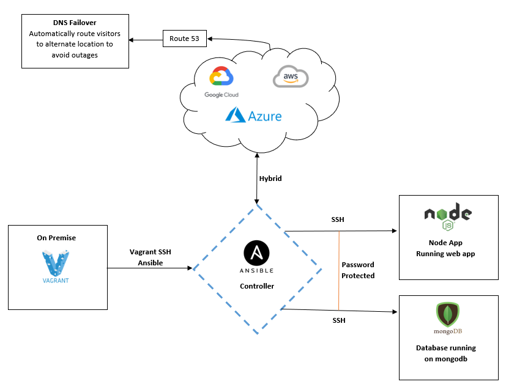

# Ansible Guide

## Ansible controller and agent nodes set up guide
- The following will set up three VMs
- Run `vagrant up` to start all three

```
# -*- mode: ruby -*-
# vi: set ft=ruby :
# All Vagrant configuration is done below. The "2" in Vagrant.configure configures the configuration version (we support older styles for backwards compatibility). Please don't change it.
# MULTI SERVER/VMs environment 
Vagrant.configure("2") do |config|

# creating first VM called web  
  config.vm.define "web" do |web|
    web.vm.box = "bento/ubuntu-18.04" # downloading ubuntu 18.04 image
    web.vm.hostname = 'web' # assigning host name to the VM
    web.vm.network :private_network, ip: "192.168.33.10" # assigning private IP
    config.hostsupdater.aliases = ["development.web"] # creating a link called development.web so we can access web page with this link instread of an IP   
  end
  
# creating second VM called db
  config.vm.define "db" do |db|
    db.vm.box = "bento/ubuntu-18.04"
    db.vm.hostname = 'db'
    db.vm.network :private_network, ip: "192.168.33.11"
    config.hostsupdater.aliases = ["development.db"]     
  end

# creating are Ansible controller
  config.vm.define "controller" do |controller|
    controller.vm.box = "bento/ubuntu-18.04"
    controller.vm.hostname = 'controller'
    controller.vm.network :private_network, ip: "192.168.33.12"
    config.hostsupdater.aliases = ["development.controller"] 
  end
end
```
## Initial set-up
- SSH into controller VM
- Install dependencies 
````
sudo apt-get update
sudo apt-get install software-properties-common
sudo apt-add-repository ppa:ansible/ansible
sudo apt-get update
sudo apt-get install ansible
sudo apt-get install tree
````
- Navigate to `cd /etc/ansible/hosts` to add web and db IP
````
[web]
192.168.33.10 ansible_connection=ssh ansible_ssh_user=vagrant ansible_ssh_pass=vagrant
[db]
192.168.33.11 ansible_connection=ssh ansible_ssh_user=vagrant ansible_ssh_pass=vagrant
````
- Check connection `ansible all -m ping`. To check one host replace all with the host name.
## Installing nginx using ansible and YAML
- Navigate to `cd /etc/ansible` 
- Create a playbook in this directory `sudo nano PLAYBOOK_NAME.yml`
- Write the code in the file, keeping an eye on indentation 
- Run the playbook `ansible-playbook PLAYBOOK_NAME.yml`
- This is a playbook to install and set up Nginx in our web server (192.168.33.10)
- This playbook is written in YAML and YAML starts with three ---
```
---
# name of the host - hosts is to define the name of your host or all
- hosts: web

# find the facts about the hosts
  gather_facts: yes

# we need admin access
  become: true

# instructions using tasks module in ansible
  tasks:
  - name: Install Nginx

# install nginx
    apt: pkg=nginx state=present update_cache=yes

# ensure its running/active
# update cache
# restart nginx if reverse proxy is implemented or if needed
    notify:
     - restart nginx
  - name: Allow all access to tcp port 80
    ufw:
        rule: allow
        port: '80'
        proto: tcp

  handlers:
    - name: Restart Nginx
      service:
```
## Installing nodejs using ansible and YAML
- Playbook name `sudo nano node_playbook.yml`
```
---
- hosts: web
  gather_facts: yes
  become: true

  tasks:
    - name: "Add nodejs apt key"
      apt_key:
        url: https://deb.nodesource.com/gpgkey/nodesource.gpg.key
        state: present

    - name: "Install nodejs"
      apt:
        update_cache: yes
        name: nodejs
        state: present
```